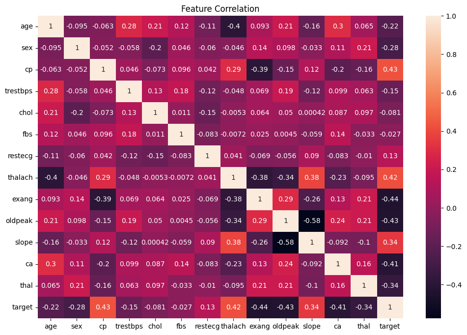
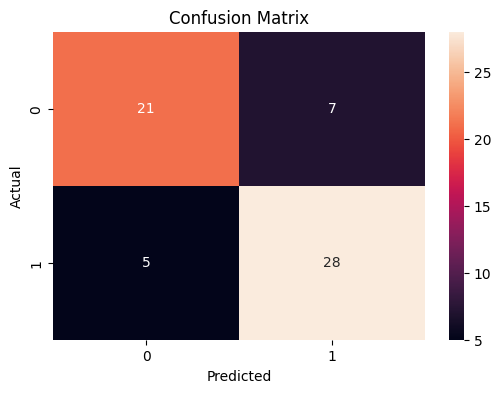
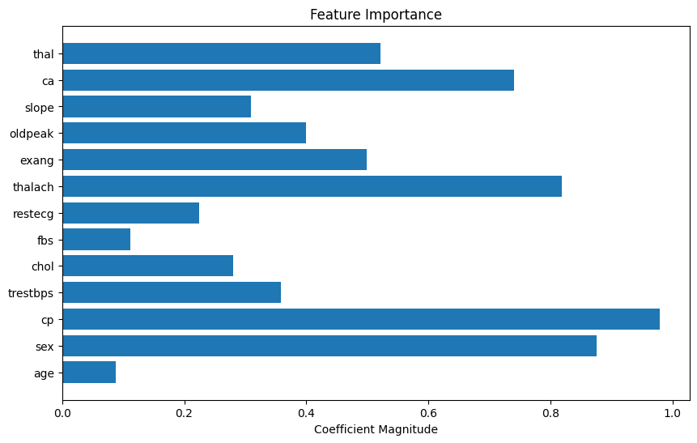

# CodeAlpha_TASK_4_DiseasePrediction
# Disease Prediction from Medical Data using Machine Learning

## Project Overview

This project predicts the possibility of heart disease using machine learning techniques on structured medical data. Multiple classification algorithms were implemented and compared to identify the model with the best predictive performance.

This project was developed as part of the CodeAlpha Machine Learning Internship.

---

## Objective

To predict the likelihood of disease occurrence based on patient medical attributes such as age, blood pressure, cholesterol level, heart rate, and other health indicators.

---

## Dataset

Dataset Used: Heart Disease Dataset

Dataset Features:

- Age
- Sex
- Chest Pain Type
- Resting Blood Pressure
- Cholesterol
- Fasting Blood Sugar
- Resting ECG
- Maximum Heart Rate
- Exercise-Induced Angina
- ST Depression
- Number of Major Vessels
- Thalassemia

Target Variable:

- 0 → No Heart Disease
- 1 → Heart Disease Present

---

## Technologies Used

- Python
- Pandas
- NumPy
- Matplotlib
- Seaborn
- Scikit-learn
- Joblib

---

## Project Workflow

1. Load Dataset
2. Data Exploration
3. Handle Duplicate Records
4. Data Visualization
5. Feature Selection
6. Data Scaling using StandardScaler
7. Train-Test Split
8. Model Training
9. Model Comparison
10. Performance Evaluation
11. Save Trained Model

---

## Models Implemented

1. Logistic Regression
2. Support Vector Machine (SVM)
3. Random Forest Classifier

---

## Model Performance

| Model | Accuracy |
|---------|----------|
| Logistic Regression | 80.3% |
| SVM | 77.0% |
| Random Forest | 75.4% |

Final Selected Model:

**Logistic Regression**

Reason for selection:

- Highest overall accuracy after preprocessing
- Balanced precision and recall
- Better generalization after duplicate removal
- Lower risk of overfitting

---

## Evaluation Metrics

The following metrics were used:

- Accuracy
- Precision
- Recall
- F1 Score
- ROC-AUC Score
- Confusion Matrix

---

## Visualizations

### Correlation Heatmap



### Confusion Matrix



### ROC Curve


### Feature Importance



---

## Files Included

```text
disease_prediction.ipynb
disease_prediction_model.pkl
scaler.pkl
requirements.txt
README.md

images/
├── correlation_heatmap.png
├── confusion_matrix.png
├── roc_curve.png
└── feature_importance.png
```

---

## Installation

Clone repository:

```bash
git clone https://github.com/yourusername/CodeAlpha_DiseasePrediction.git
```

Install required libraries:

```bash
pip install -r requirements.txt
```

Run Jupyter Notebook:

```bash
jupyter notebook
```

---

## Future Improvements

- Add more medical datasets
- Implement XGBoost
- Build a web application using Streamlit
- Add explainable AI techniques such as SHAP
- Extend prediction to multiple diseases

---

## Conclusion

This project demonstrates how machine learning can assist in disease prediction using medical data. Multiple models were evaluated, and Logistic Regression was selected as the final model due to its balanced performance and strong generalization capability.

---

## Author

Veldandi Prakarsha

Machine Learning Intern — CodeAlpha
